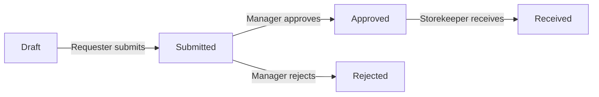

# ERP Workflow Lab

An independent, portfolio-focused ERP demo that implements a controlled
procurement-to-inventory workflow. It demonstrates how business requirements,
role permissions, state transitions, API-backed interfaces, database records,
and automated tests fit together in one small system.

> This project uses no proprietary company code, data, documents, or internal
> workflows. The selected roles are a transparent demo mechanism, not production
> authentication.

## What the system demonstrates

- A requester creates and submits a purchase request.
- A manager approves or rejects the submitted request.
- A storekeeper receives an approved request.
- Receiving updates item quantities exactly once.
- Each receipt creates an append-only stock-movement record.
- The backend rejects unauthorized actions and invalid state transitions.
- A dashboard summarizes open work, pending approvals, and low-stock items.

## Technology

| Area | Technology |
|---|---|
| Frontend | React 19, TypeScript, Vite |
| Backend | FastAPI, Pydantic, SQLAlchemy |
| Data | PostgreSQL in Docker, SQLite in tests |
| Delivery | Docker Compose, Nginx, GitHub Actions |
| Quality | Pytest, Ruff, ESLint, TypeScript build |

## Workflow



Detailed requirements and explicit non-goals are in
[docs/requirements.md](docs/requirements.md). The system boundary and demo-auth
tradeoff are documented in [docs/architecture.md](docs/architecture.md).

## Run with Docker

```bash
docker compose up --build
```

Then open:

- Web application: http://localhost:8080
- Interactive API docs: http://localhost:8000/docs
- Health endpoint: http://localhost:8000/api/health

## Run for development

Backend:

```bash
cd backend
python -m venv .venv
source .venv/bin/activate  # Windows PowerShell: .venv\Scripts\Activate.ps1
python -m pip install -e ".[dev]"
uvicorn app.main:app --reload
```

Frontend in a second terminal:

```bash
cd frontend
npm install
npm run dev
```

Open http://localhost:5173.

## Verify

```bash
cd backend
ruff check .
pytest -q

cd ../frontend
npm run lint
npm run build
```

## Current scope

This first release intentionally stops at receipt into inventory. Supplier
quotations, purchase orders, invoices, production identity, notifications, and
multi-company tenancy are documented non-goals rather than unfinished claims.

## Author

Haya Alsubaie — Software Engineer focused on ERP and business systems, with a
background in databases, data science, and AI.
