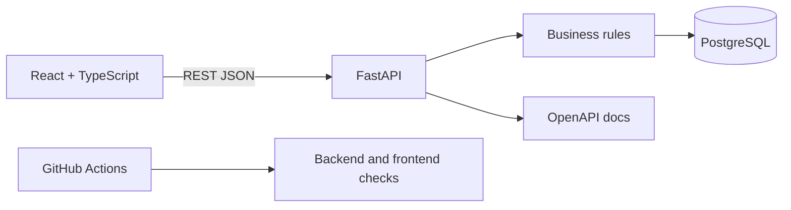

# Architecture

The backend owns state transitions and authorization rules. The frontend never
updates stock quantities directly. PostgreSQL is used in Docker; SQLite is used
for fast isolated automated tests.

## Demo Authorization

The selected role is sent in `X-User-Role` and the display name in
`X-User-Name`. This makes role behavior easy to demonstrate, but it is not
secure authentication. A production implementation would replace it with an
identity provider and server-validated tokens or sessions.
