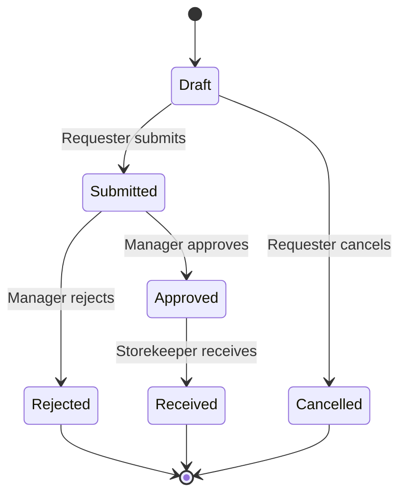

# Business Requirements

## Goal

Demonstrate a small but complete procurement-to-inventory workflow without using
any proprietary company code, data, or processes.

## Roles

| Role | Responsibilities |
|---|---|
| Requester | Create and submit purchase requests |
| Manager | Approve or reject submitted requests |
| Storekeeper | Maintain items and receive approved requests |
| Admin | Perform all demo operations |

## Workflow

## Core Rules

1. A request must contain at least one line and every quantity must be positive.
2. Only a draft request can be submitted or cancelled.
3. Only a submitted request can be approved or rejected.
4. Only an approved request can be received.
5. Receiving a request increases item quantities exactly once.
6. Every receipt creates append-only stock-movement records.
7. Final states cannot be changed through the API.

## Explicit Non-Goals

- Production authentication or identity-provider integration
- Supplier quotation comparison
- Purchase orders, invoices, taxes, or payments
- Multi-company tenancy
- Email or push notifications
